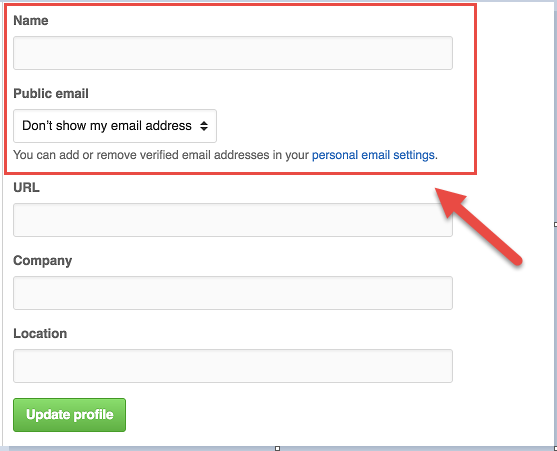
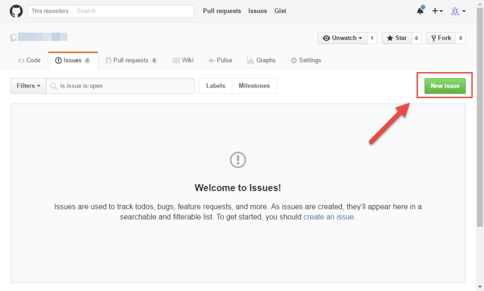
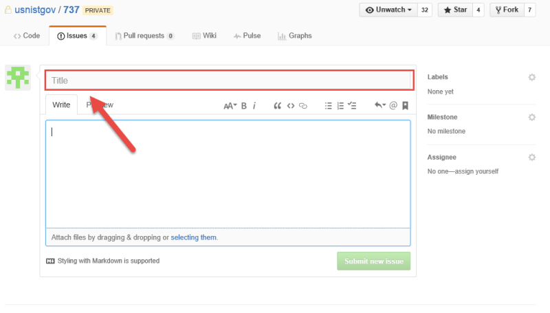
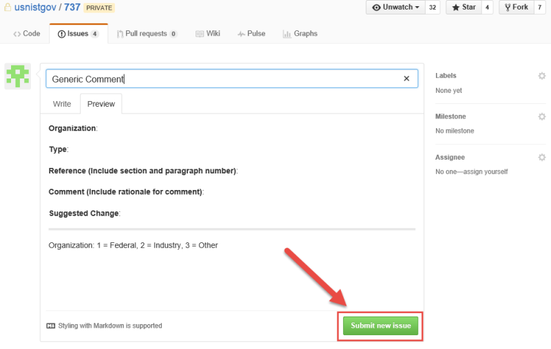
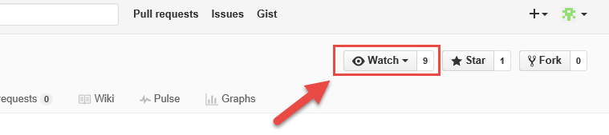

# Providing Feedback

**Review the documentation.** No account is needed to review the updated version of NIST SP 800-63-3. Simply follow [this link](https://github.com/usnistgov/800-63-3) and enjoy at your leisure. However, if you wish to comment you must…

1. **Establish a GitHub account.** In order to submit a comment through the GitHub “Issues” feature, you will need to create a GitHub account. This can be done by proceeding to https://github.com/join. If this is a personal account, GitHub allows you to remain pseudonymous if you would like, just make sure you select the options that suit you on the “Profile” and “Emails” pages of your “Personal Settings”.  We also highly encourage you to turn on two-factor authentication in the “Security” page, also part of “Personal Settings”. **For issues submitted on behalf of an organization, we prefer a generic account named for the organization, rather than a personal account from someone within the organization.**
  

2. **Open an issue.** As you are reading and identify comments you would like to make:

    1. Click on either the "Comment" link in the sidebar navigation or the "Send Feedback" link in the footer of the page.
    
    2. Review open and closed issues to determine if a similar issue has already been created.

    2. Click on the "New Issue" button in the upper right of the screen.  
    

    4. Provide a short description in the field labelled "Title" for the feedback being provided.  
    

    5. Within the field labelled "Leave a comment", fill out the comment template and provide as much information as possible.

            **Organization Name**:

            **Organization Type**:
            
            **Document (63-3, 63A, 63B, or 63C)**:

            **Reference (Include section and paragraph number)**:

            **Comment (Include rationale for comment)**:

            **Suggested Change**:

            ---

            Organization: 1 = Federal, 2 = Industry, 3 = Academia, 4 = Self, 5 = Other

    6. Hit “Submit New Issue” and you are done!  
    

    7. If you want to keep up with others comments through email and monitor future changes, make sure you choose to “Watch” the project!  
    

If you are familiar with GitHub you are also welcome to provide suggestions to concrete changes as a pull request (PR). We prefer PRs as follows:

1. Fork a copy of USNISTGOV/800-63-3 to your own organization/personal space.
2. Create a branch in your fork, named specifically for the edit you propose.  We prefer focused PR's rather than broad-sweeping updates.
3. Issue a PR from your branch to the `post-public-comment` branch in USNISTGOV/800-63-3.
4. If we intend to merge the PR, we may engage via PR reviews and request changes before completing the merge.

Please provide information about your organization and rationale for the suggested change.
