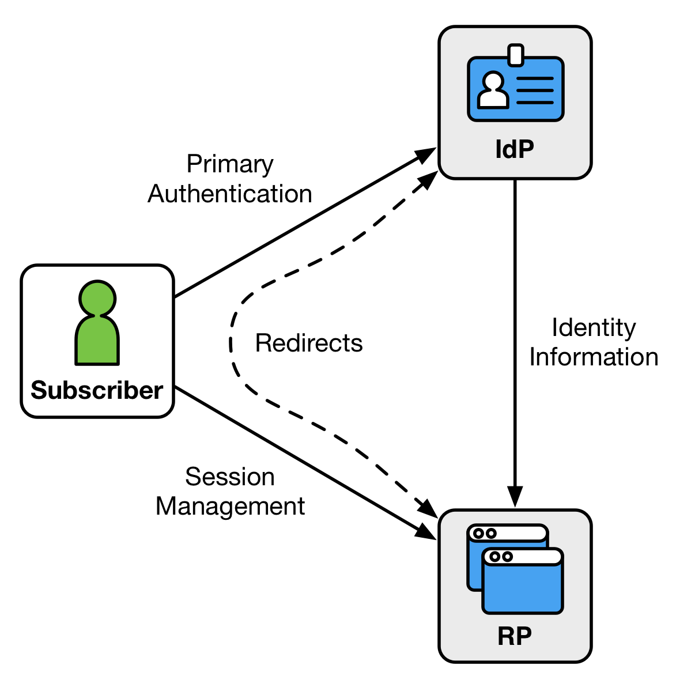
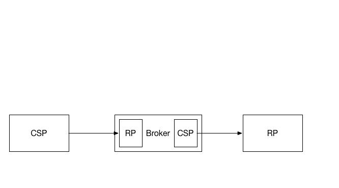

## 4. Federation
Federation is a process that allows for the conveyance of identity and authentication information across a set of networked systems. In a federation scenario, the verifier or CSP is often known as the *identity provider*, or IdP.

**Figure 1: Federation**

In a federation protocol, a triangle is formed between the subscriber, the CSP, and the RP (Figure 1). Depending on the specifics of the protocol, different information passes across each leg of the triangle at different times. The subscriber communicates with both the CSP and the RP, usually through a web browser. The RP communicates with the CSP, though this communication can happen indirectly (through redirects involving the subscriber), directly (through a back-channel connection), or via a packaged information bundle (such as a cryptographically protected and self-contained assertion).

The subscriber authenticates to the CSP using some form of primary credential, and then that authentication event is asserted to the RP across the network. The CSP can also make attribute statements about the subscriber as part of this process. These attributes and authentication event information are usually carried to the RP through the use of an assertion (see section 5.). 

## 4.1. Federation Models
This section provides an overview of a few common models of identity federation currently in use. In these models, trust is established between members of the federation in several different ways. Some models mandate that federated parties have a high level of trust. Other models allow for parties with a diversity of trust relationships.

#### 4.1.1 Central Authority
Some federated parties trust a central authority to make trust decisions for them and communicate metadata between parties. In this model, the central authority generally conducts some level of vetting on each party in the federation to verify compliance with predetermined security and integrity standards.

Most federations using the central authority model have a single level of trust - either parties are in the federation or they are not. However, more sophisticated federations have multiple tiers of trust which can be used by federated parties to tell whether other parties in the federation have been more thoroughly vetted or have some common purpose that justifies a higher level of trust. This higher level of trust makes some parties in the federation more likely to automatically release information about their users to the parties in the higher tiers.

#### 4.1.2 Manual Registration
In the manual registration model of federation, system administrators communicate metadata and test system interoperability before transactions take place between users over the wire. Metadata for each party who wishes to participate is manually input into a registry of federated parties. Each party maintains their own registry of other parties whom they have deemed trustworthy.

Manual registration can take place on a case by case basis without any authority or federation operator in place. In this case, an existing pairwise trust relationship is generally already in place between the CSP and the RP. 

Manual registration can work in concert with a central authority model. In this case, a registry is pre-populated with parties trusted by the central authority, and more parties are added manually on an as-needed basis.

#### 4.1.3 Dynamic Registration
In the dynamic registration model of federation, systems have a well-known location where other systems can find their metadata. They also have predictable API endpoints where new systems can register themselves without human involvement. Systems that make use of dynamic registration SHOULD require verifiable human interaction, such as the approval of the identity federation transaction by the authenticated subscriber at the CSP. 

Frequently, parties in a dynamic registration model have no way to trust each other ahead of time, so little information is exchanged by default. This problem is somewhat mitigated by a technology called software statements, which allow federated parties to cryptographically verify some attributes of the parties involved in dynamic registration. Software statements are lists of attributes describing the RP software, cryptographically signed by certifying bodies. Because both parties trust the certifying body, that trust can be extended to the other party in the dynamic registration partnership.  This allows trust to be established or elevated between the federating parties.

Many federated parties establish whitelists of other federated parties who may dynamically register with some predetermined level of trust. They also establish blacklists of federated parties who may be allowed dynamically register with a low level of trust, or who may not be allowed to dynamically register at all. Everything that is not on a whitelist or a blacklist can be considered to be in a gray area or on a "graylist." Graylisted parties generally start out with a low level of trust until they can be reviewed by a human who can determine an appropriate level of trust. 

#### 4.1.4 Brokered Federation
For some specific privacy and technology reasons, some federated parties choose to blind themselves from knowing which other members of the federation they are interacting with. For example, a government-run RP might wish to use a bank as a CSP, but for privacy reasons would prefer not to know where its citizens have bank accounts. In this model, a third-party would sit in the middle of the transaction and communicate the success or failure of an authentication event at the CSP without disclosing the source of that information to the RP. Likewise for privacy reasons a bank may not wish to know which government services its customers are using, and thus would want to tell the broker that an authentication event occurred without the broker disclosing why or by whom that authentication event was requested.

**Figure 2: Broker**

Effectively, a broker functions as a federation CSP on one side and a federation RP on the other side. The assertions passing through the broker can be translated from one side to the other, allowing the broker to blind the participants on either side of the transaction to each other. 

There are two types of brokers: *traditional* and *blinded*. A traditional broker blinds the RP and the CSP from each other, but is able to monitor and track all user transactions at both parties. This type of broker is concerning to many privacy advocates because while the CSP and RP do not know the full nature of the transaction, the broker knows everything its users do. For this reason, some federated models use a blind broker. A blind broker uses some combination of opaque identifiers and encrypted attribute bundles to help the CSP and RP communicate, but is intentionally limited in its ability to deduce information about specific user behavior. Blinded brokers are significantly more complex to deploy properly at the time of this writing.

